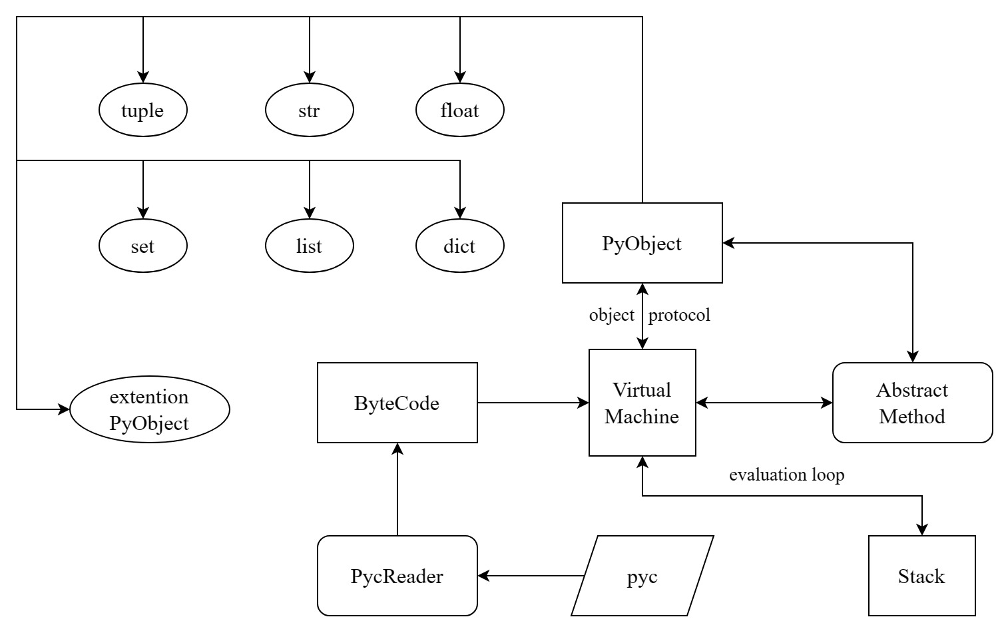

# jpvm

# 项目介绍

使用 Java 语言重写 python 虚拟机，整个虚拟机的架构如下所示：



本项目重点实现虚拟机的部分，因此仍然使用 python 作为语言的编译器，可以使用编译之后的结果文件 .pyc 作为虚拟机的输入，本项目实现了对于
pyc 文件的解析与加载，并且将其封装成一个 `PyCodeObject` 对象。

# Demo

```python
def fib(n):
    if n == 0:
        return 0
    if n == 1:
        return 1
    return fib(n - 1) + fib(n - 2)


if __name__ == '__main__':
    print(fib(10))
```

使用如下命令对文件进行编译：

```bash
python -m compileall fib.py
```

执行上面的命令之后将会在当前目录下面有一个子目录  `__pycache__` 会存在一个文件 `fib.cpython-38.pyc` 。使用下面的 Java
程序执行这个 python 程序：

```java
import org.jpvm.errors.PyException;
import org.jpvm.pvm.PVM;

import java.io.IOException;

public class Example {

	public static void main(String[] args) {
		String filename = "src/test/resources/syntax/__pycache__/fib.cpython-38.pyc";
		try {
			new PVM(filename).run();
		} catch (PyException | IOException e) {
			throw new RuntimeException(e);
		}
	}
}
```

# 方法调用

在上面的例子当中我们定义了一个函数 fib ，那么我们可以直接在 Java 当中调用这个函数，更简洁的是可以通过函数名和 Java 本地对象进行参数传递：

```java
public void testCall() {
  String filename = "src/test/resources/obsy/__pycache__/test06.cpython-38.pyc";
  try {
    PVM pvm = new PVM(filename);
    pvm.run();
    System.out.println(pvm.call("fib", 10));
  } catch (PyException | IOException e) {
    throw new RuntimeException(e);
  }
}
```

# 使用Java语言扩展标准库

在 python 当中我们可以通过 import 方式导入标准库或者第三方库，他们进行扩展的方式基本一致，只不过创建 Java 文件的路径有要求。当你想要在本项目当中进行扩展的时候你所有创建的文件都必须要在 org/jpvm/stl 这个目录下面，你可以采用两种方式进行包扩展：

- 当你在 python 当中导入一个名为 math 的包的时候，你可以在 org/jpvm/stl 这个目录下面创建一个 math.java 的文件，如下所示：

```bash
└── org
    └── jpvm
        └── stl
            ├── math.java
```

然后这个类需要继承 `PyModuleObject`，你一共有两种方式可以提供接口给 python 层面使用，一个是 `PyClassAttribute` 注解，另一个是 `PyClassMethod` 注解，分别用在字段和方法上面，当你的 python 程序如下时：

```python
import math

print(math.PI)
print(math.pi)
print(math.ceil(1.3))
```

你需要在 math.java 当中创建一个名为 ceil 的方法，名为 PI 和 pi 的字段，方法和字段分别需要使用 `PyClassMethod` 和 `PyClassAttribute` 进行修饰：

```java
package org.jpvm.stl;

import org.jpvm.errors.PyException;
import org.jpvm.objects.*;
import org.jpvm.objects.annotation.PyClassAttribute;
import org.jpvm.objects.annotation.PyClassMethod;
import org.jpvm.protocols.PyNumberMethods;

public class math extends PyModuleObject {
  @PyClassAttribute
  public PyObject PI;

  @PyClassAttribute
  public PyObject pi;

  public math(PyUnicodeObject name) {
    super(name);
    PI = new PyFloatObject(Math.PI);
    pi = PI;
  }


  @PyClassMethod
  public PyObject abs(PyTupleObject args, PyDictObject kwArgs) throws PyException {
    if (args.size() == 1) {
      var value = args.get(0);
      if (value instanceof PyNumberMethods num) {
        return num.abs();
      }
    }
    throw new PyException("TypeError : abs() argument must be a number");
  }

  @PyClassMethod
  public PyObject ceil(PyTupleObject args, PyDictObject kwArgs) throws PyException {
    if (args.size() == 1) {
      var value = args.get(0);
      if (value instanceof PyLongObject object) return object;
      if (value instanceof PyFloatObject floatObject)
        return new PyFloatObject(Math.ceil(floatObject.getData()));
    }
    throw new PyException("TypeError : ceil() argument must be a number");
  }
}
```

在进行扩展的时候需要注意所有的字段都必须是 `PyObject` 对象，函数返回的对象类型必须是 `PyObject` 类型，函数参数签名必须是 `PyTupleObject args, PyDictObject kwArgs` 。同时需要保证有一个构造函数的函数参数的函数签名为 `public math(PyUnicodeObject name)` 。

- 除此之外你还可以使用下面一种方式进行扩展，有的时候我们需要扩展的模块非常复杂，写在一个类文件当中过于臃肿，因此你可以使用这种方式，在 org/jpvm/stl 目录下创建你的包名，包名需要和你在 python 层面导入的包名需要相同，然后在这个包下创建一个名为 PyModuleMain 的 Java 类，比如你要导入的包名为 random，那么你的文件目录结构需要如下：

```bash
└── org
    └── jpvm
        └── stl
            └── random
                └── PyModuleMain.java
```

# Contribution

如果你想为本项目进行标准库的扩展，请首先在本项目当中提出 issue，欢迎大家👏提交 pr。

# 使用

如果在你的项目当中引入了本项目的 jar 包，你可以在你的项目当中创建一个名为 org.jpvmExt 的包，然后在这个包当中使用上面同样的方式进行扩展，jpvm 在进行包导入的时候会扫描你项目当中的 org.jpvmExt 寻找对应的包。

```bash
└── org
    └── jpvmExt
        ├── Fib.java
        └── hello.java
```

