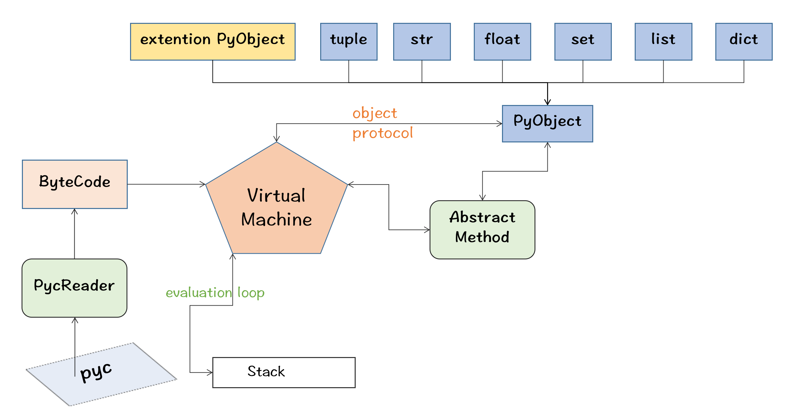

# jpvm

[中文文档](README.md)

# Introduction

Rewriting the Python virtual machine in the Java language, the overall architecture of the virtual machine is as follows



The project primarily focuses on implementing a portion of the virtual machine. Therefore, Python is still used as the
language for the compiler. The compiled result file, `.pyc`, can be used as input for the virtual machine. The project
implements the parsing and loading of `.pyc` files, encapsulating them into a `PyCodeObject` object.

# Demo

```python
def fib(n):
    if n == 0:
        return 0
    if n == 1:
        return 1
    return fib(n - 1) + fib(n - 2)


if __name__ == '__main__':
    print(fib(10))
```

To compile the file, use the following command:

```bash
python -m compileall fib.py
```

After executing the above command, a subdirectory named `__pycache__` will be created in the current directory,
containing a file named `fib.cpython-38.pyc`. Use the following Java program to execute this Python program:

```java
import org.jpvm.errors.PyException;
import org.jpvm.pvm.PVM;

import java.io.IOException;

public class Example {

	public static void main(String[] args) {
		String filename = "src/test/resources/syntax/__pycache__/fib.cpython-38.pyc";
		try {
			new PVM(filename).run();
		} catch (PyException | IOException e) {
			throw new RuntimeException(e);
		}
	}
}
```

# Method call

In the above example, we defined a function called `fib`. We can directly call this function in Java, and it's even
possible to pass parameters using the function name and Java native objects:

```java
public void testCall(){
		String filename="src/test/resources/obsy/__pycache__/test06.cpython-38.pyc";
		try{
		PVM pvm=new PVM(filename);
		pvm.run();
		System.out.println(pvm.call("fib",10));
		}catch(PyException|IOException e){
		throw new RuntimeException(e);
		}
		}
```

# Extend the standard library using the Java language

In Python, we can import standard libraries or third-party libraries using the import statement. The process of
extending them is generally the same. However, there are certain requirements for the Java file paths when you want to
extend them within this project. All the files you create must be located under the `org/jpvm/stl` directory. You can
use two approaches for package extension:

- When you import a package named `math` in Python, you can create a file named `Math.java` under the `org/jpvm/stl`
  directory, as shown below:

```bash
└── org
    └── jpvm
        └── stl
            ├── math.java
```

And this class needs to inherit from `PyModuleObject`. There are two ways to provide interfaces for Python usage. One is
using the `PyClassAttribute` annotation, and the other is using the `PyClassMethod` annotation. They are used for fields
and methods respectively. When your Python program looks like this:

```python
import math

print(math.PI)
print(math.pi)
print(math.ceil(1.3))
```

In `math.java`, you need to create a method named `ceil`, and fields named `PI` and `pi`. The method and fields should
be annotated with `PyClassMethod` and `PyClassAttribute` respectively.

```java
package org.jpvm.stl;

import org.jpvm.errors.PyException;
import org.jpvm.excptions.PyErrorUtils;
import org.jpvm.objects.*;
import org.jpvm.objects.annotation.PyClassAttribute;
import org.jpvm.objects.annotation.PyClassMethod;
import org.jpvm.protocols.PyNumberMethods;

public class math extends PyModuleObject {
	@PyClassAttribute
	public PyObject PI;

	@PyClassAttribute
	public PyObject pi;

	public math(PyUnicodeObject name) {
		super(name);
		PI = new PyFloatObject(Math.PI);
		pi = PI;
	}


	@PyClassMethod
	public PyObject abs(PyTupleObject args, PyDictObject kwArgs) throws PyException {
		if (args.size() == 1) {
			var value = args.get(0);
			if (value instanceof PyNumberMethods num) {
				return num.abs();
			}
		}
		PyErrorUtils.pyErrorFormat(PyErrorUtils.TypeError, "TypeError : abs() argument must be a number");
		return null;
	}

	@PyClassMethod
	public PyObject ceil(PyTupleObject args, PyDictObject kwArgs) throws PyException {
		if (args.size() == 1) {
			var value = args.get(0);
			if (value instanceof PyLongObject object) return object;
			if (value instanceof PyFloatObject floatObject)
				return new PyFloatObject(Math.ceil(floatObject.getData()));
		}
		PyErrorUtils.pyErrorFormat(PyErrorUtils.TypeError, TypeError :ceil() argument must be a number ");
		return null;
	}
}
```

When extending the code, it's important to note that all fields must be of type `PyObject`. The return type of functions
should also be `PyObject`. The function parameter signature should be `PyTupleObject args, PyDictObject kwArgs`.
Additionally, ensure that there is a constructor function with the parameter
signature `public xxx(PyUnicodeObject name)`.

- In addition to the previous approach, there's another way to extend the code. Sometimes, when the module you want to
  extend is complex, it may become unwieldy to have everything in a single class file. In such cases, you can use this
  approach: create a package under `org/jpvm/stl` with the same name as the package you imported in Python. Then, within
  this package, create a Java class named `PyModuleMain`. For example, if the package you want to import is `random`,
  your directory structure should look like this:

```bash
└── org
    └── jpvm
        └── stl
            └── random
                └── PyModuleMain.java
```

# Contribution

If you would like to extend the standard library for this project, please start by opening an `issue` in the project
repository. 👏We welcome everyone to submit `pull requests (PRs)`.

# Usage

If you have included the JAR package of this project in your own project, you can create a package named `org.jpvmExt`
within your project. Then, you can use the same approach mentioned above to extend the functionality within this
package. When the `jpvm` library performs package imports, it will scan your project's `org.jpvmExt` package to find the
corresponding extensions.

```bash
└── org
    └── jpvmExt
        ├── Fib.java
        └── hello.java
```

